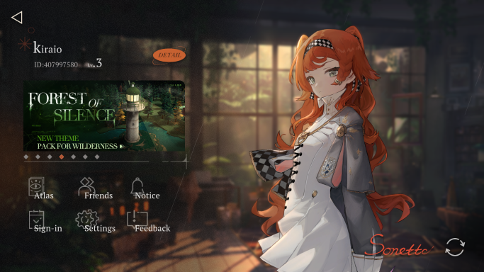

  
  
<a href="https://re1999.bluepoch.com/" title="Visit Reverse 199 official page">Reverse: 1999</a> [BLUEPOCH] game assets encoder/decoder.

  Add me as your friend UwU
   
  
   
  ID: 407997580

## Features

- Encrypt/Decrypt asset bundle file (`.dat`).
- Encode/Decode Wwise (Wave Works Interactive Sound Engine) files (`.bnk`, `.wem`) [Ongoing]

## Requirements

- [.NET 6.0 SDK](https://dotnet.microsoft.com/download/dotnet/6.0 "Download .NET 6.0 SDK") / [.NET 7.0 SDK](https://dotnet.microsoft.com/download/dotnet/7.0 "Download .NET 7.0 SDK") / [.NET 8.0 SDK](https://dotnet.microsoft.com/download/dotnet/8.0 "Download .NET 8.0 SDK")

## Usages

- Asset Bundle
  - Run the executable.
  - Decrypt:  
    Just choose ENCRYPTED asset bundle(s) to decrypt. The output file should have `_DEC` suffix.
  - Encrypt:  
    The encryption process requires you to put the ORIGINAL and DECRYPTED asset bundle(s) at the same directory. The DECRYPTED asset bundle(s) file name MUST follow this rule: `Original Name_whatever you put there`. This tool will detect a file with the name before the UNDERSCORE.

## License

This project is licensed under GNU GPL 3.0.
For more information about the GNU General Public License version 3.0 (GNU GPL 3.0), please refer to the official GNU website: <https://www.gnu.org/licenses/gpl-3.0.html>

## Credits

- [wanderer-moe](https://github.com/wanderer-moe "Visit wanderer-moe GitHub profile") for [reverse1999-decrypt](https://github.com/wanderer-moe/reverse1999-decrypt "Visit reverse1999-decrypt repository").

## Disclaimer

This project is not affiliated with BLUEPOCH nor any their affiliator.
This project is intended only as a modding tool. Any game assets that used in this project is property and copyright of those respective authors.
